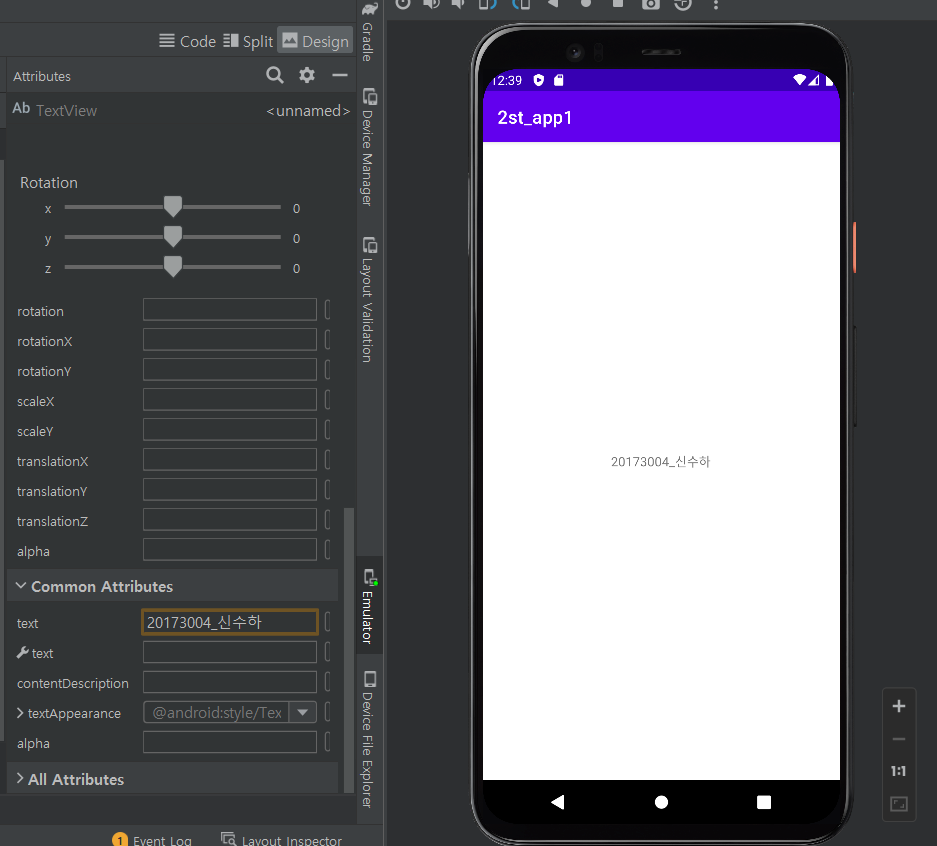
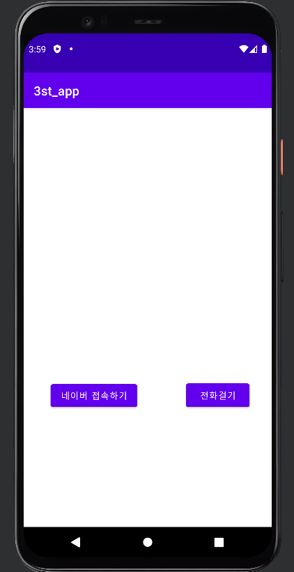
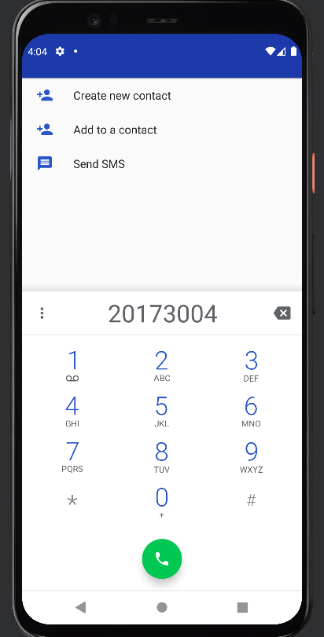
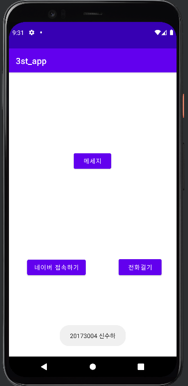

# 2주차(2022-03-15)
- 안드로이드스튜디오 설치 && Github 가입 및 레포지토리 만듬
  - </img>

# 3주차(2022-03-22)
- 화면에 두개의 버튼 추가하여 네이버 접속하기와 전화 걸기 만듬
  - </img>
    </img>
    </img>

# 4주차(2022-03-29)
- 버튼 추가하여 Toast 보여주기
  - </img>
  
