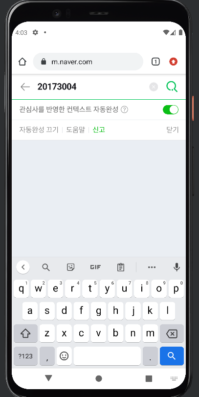

# 2주차(2022-03-15)
- 안드로이드스튜디오 설치 && Github 가입 및 레포지토리 만듬
  - </img>

# 3주차(2022-03-22)
- 화면에 두개의 버튼 추가하여 네이버 접속하기와 전화 걸기 만듬
  - </img>
    </img>
    </img>

# 4주차(2022-03-29)
- 버튼 추가하여 Toast 보여주기
  - </img>

# 5주차(2022-04-05)
- 상속 개념과 (수직,수평)가이드 라인을 통해 버튼 정렬하기
  - </img>
    </img>
    </img>
    </img>
    
# 6주차(2022-04-12)
- 스크롤뷰 사용하기
  - </img>
    </img>
  
# 10주차(2022-05-10)
- 화면 간 전환하기
  - </img>
    </img>
    
# 11주차(2022-05-17)
- 웹으로 요청하고 결과 받아오기
  - </img>

# 12주차(2022-05-24)
- github 연동하기
  - </img>
